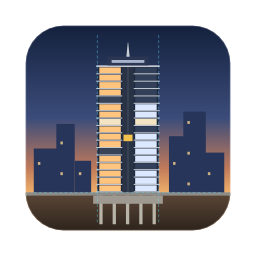

# Skyline Architect

An original, native vertical-building management simulation for macOS (primary), iPadOS
and iPhone (landscape). Swift · SwiftUI · SpriteKit. No third-party engines, no copied assets.

## What the game does (0.30.0)

Build a tower in cross-section and keep it running.

| Area | What you get |
|------|--------------|
| **Construction** | Floors, rooms and shafts on a grid, with structural rules; foundations that grow wider, deeper and on longer piles. Undo and redo. Construction costs and refunds. |
| **People** | Every resident, worker and staff member is simulated: schedules, walking and stairs, elevators with patience, route planning with sky-lobby transfers. |
| **Elevators** | Cars, banks, express shuttles, and three dispatch strategies with statistics and a traffic overlay. |
| **Amenities** | Shops, a restaurant, a fitness club, a cinema, a theatre and a sky bar, run by operators; visitors from the street and the building's own people; a share of the takings. |
| **Tenants** | A rental market with flats for sale beside flats for rent, where prospects appraise rent, access, noise, view and services, with satisfaction and move-outs. |
| **Economy** | Ledger, rent per building and per unit, running costs, taxes, energy prices, waste collection, loans and bankruptcy. |
| **Facilities** | Utilities with a reach and a capacity, wear and dirt, janitors and technicians housed in staff rooms, and elevator wear with breakdowns. |
| **Progression** | Reputation and building classes that unlock rooms, height and tenants. |
| **Environment** | Day and night with lighting energy, and weather with seasons, forecasts and effects. |
| **Emergencies** | Fires, sprinklers, evacuation, and storm damage. |
| **Estate** | Three cities with their own markets, ground and weather, land for sale, and the whole estate simulating at once. |
| **Scenarios** | Objectives against the clock, from Opening Day to Lean Tower. They have scripted events and restrictions, stars and points, and a completion record on the device. |
| **Modding** | JSON content packs over the base game, validated per mod, with a mod manager and an example mod. |
| **Saves** | Versioned format (18) with migrations and golden fixtures, a content hash per pack; optional iCloud Drive sync that keeps both versions on a conflict. |
| **Scale** | Profiled on generated towers up to 526 floors and 2,500 people; elevator shafts up to 1,000 floors. |
| **Help** | A step-by-step tutorial scenario, first-time tips and a 14-chapter manual in the game; the same manual is on the website (`Website/`). |
| **Polish** | Procedural art throughout, clouds, the app icon, VoiceOver labels and Reduce Motion. |

**Honest status.** Every system above is implemented, tested and seen working in automated
captures. The following have not been done or verified:

* no human play test;
* the iPad and iPhone builds run in simulators only, not yet on a real device;
* iCloud needs a signing team;
* balancing is first-pass.

See [Development/STATUS.md](Development/STATUS.md).

## Build and run

- **Play:** open `SkylineArchitect.xcodeproj` in Xcode 16+ and run the `SkylineArchitect` scheme (My Mac).
- **Test** the engine: `Scripts/test-package.sh` (also runs on Linux, 300+ tests).
- **Profile:** `cd Packages/SkylineKit && swift run -c release skyline-bench --zones 10 --width 64`.
- **Regenerate the icon:** `Scripts/make-icon.sh`.

## Where to read next

- `CLAUDE.md` — development rules.
- `Documentation/ARCHITECTURE.md` — module boundaries.
- `Documentation/DECISIONS.md` — why things are the way they are.
- `Documentation/OPEN_ITEMS.md` — everything still open, in one checklist.
- One document per system in `Documentation/` (SIMULATION, ELEVATORS, TENANTS, ECONOMY, FACILITIES, PROGRESSION, LIGHTING, WEATHER, EMERGENCIES, ESTATE, SCENARIOS, MANUAL, MODDING, SAVE_FORMAT, PERFORMANCE, GRAPHICS, ACCESSIBILITY).
- `Development/Screenshots/Phase-XX/` — real captures of every phase, with notes.
- `Website/` — the website for www.skyline-architect.com; the player's manual is in `Website/manual/` (generated, see `Website/README.md`).
